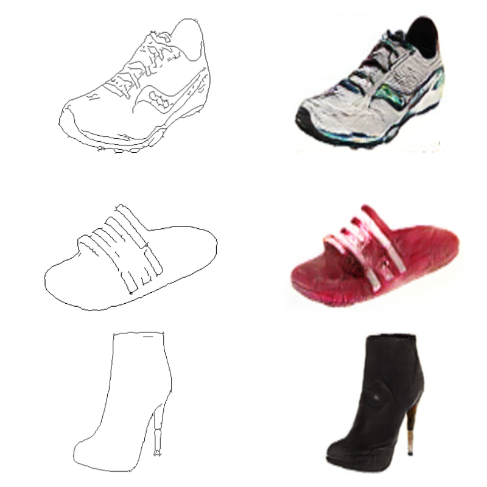
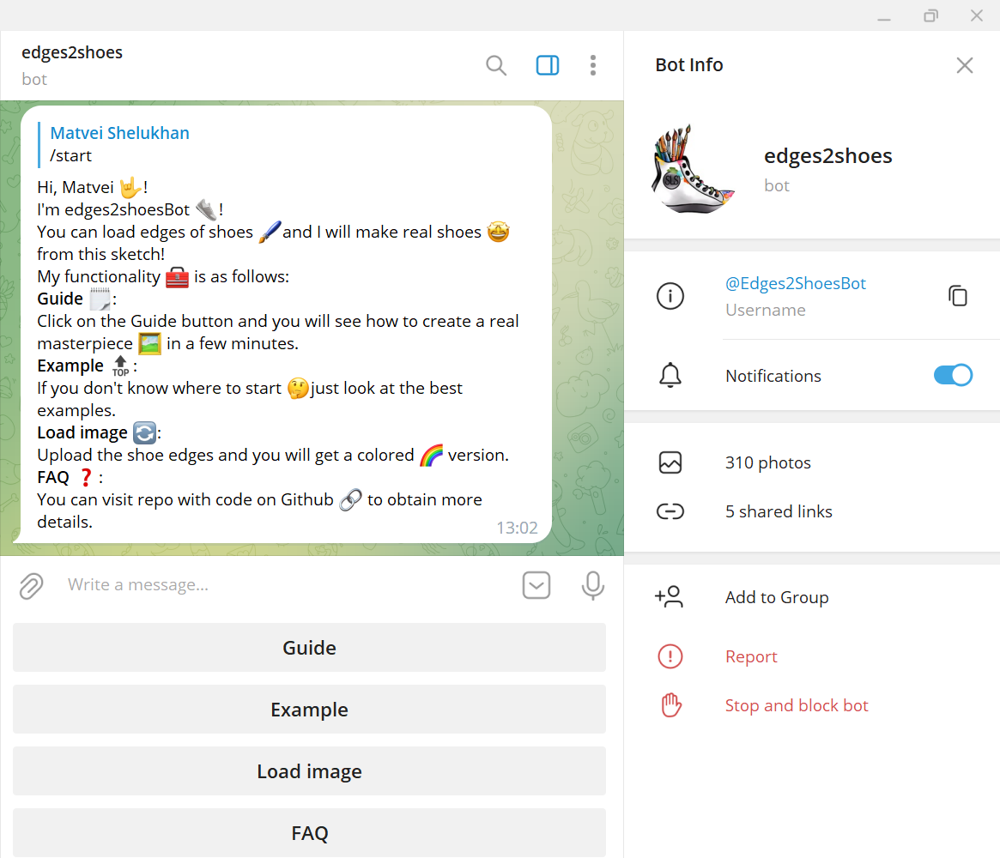
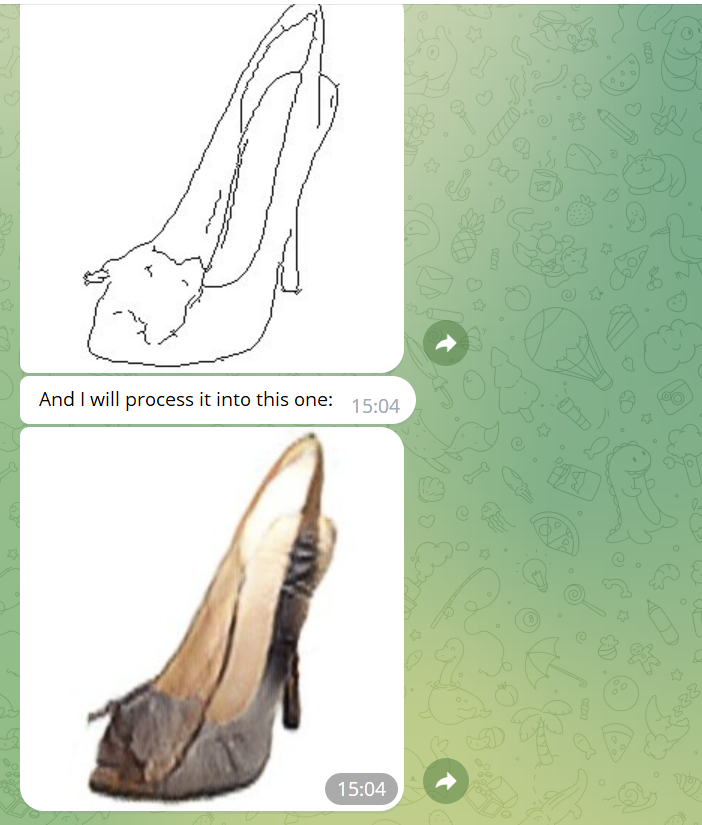
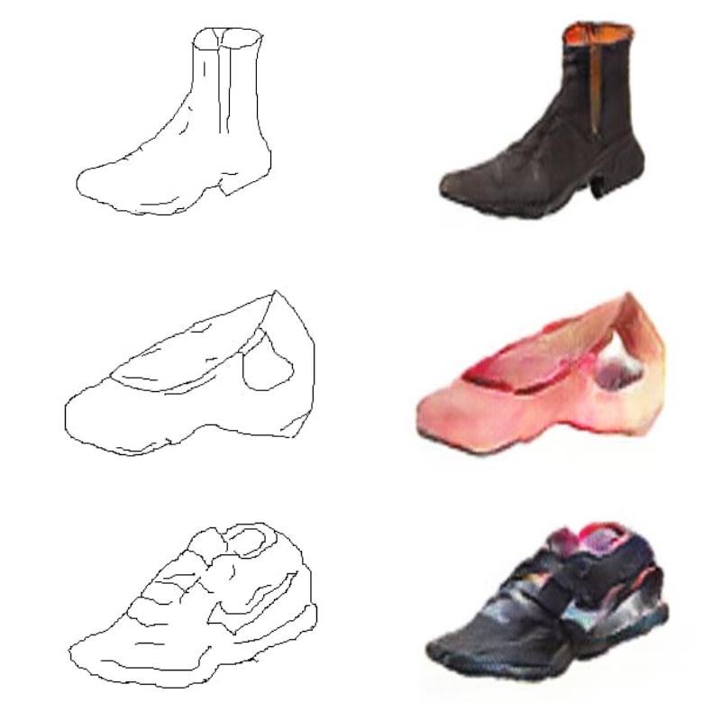

# Pix2Pix

My implementation of [Pix2Pix model](https://github.com/junyanz/pytorch-CycleGAN-and-pix2pix). Pix2Pix is the conditional generative model for creating images based on an input image. These networks not only learn the mapping from input image to output image, but also learn a loss function to train this mapping. This makes it possible to apply the same generic approach to problems that traditionally would require very different loss formulations. Examples of images for validation can be seen in the *examples*. The code for training models and the architectures themselves are in the *nets*. The code for the model inference and related metrics are in the *eval*.
For inference, I present telegram bot [Edges2Shoes](https://t.me/Edges2ShoesBot) (Unfortunately, I did not deploy it to any server - just run it locally. But, **in the future**, I plan to create Dockerfile and use it in some cloud provider). To write an asynchronous bot, the *aiogram* library was used. All the code in the *bot*.

***
# Telegram Bot





***
# Human-drawn sketches


***
# Requirements
```python
aiogram==2.25.1
emoji==2.2.0
Pillow==9.5.0
pytorch_fid==0.3.0
scikit_learn==1.2.2
scipy==1.10.1
torch==2.0.0
torchvision==0.15.1
```
